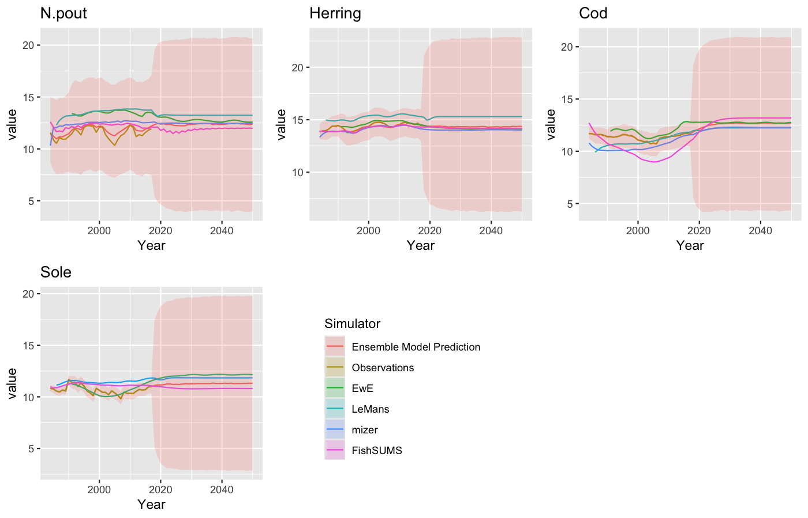
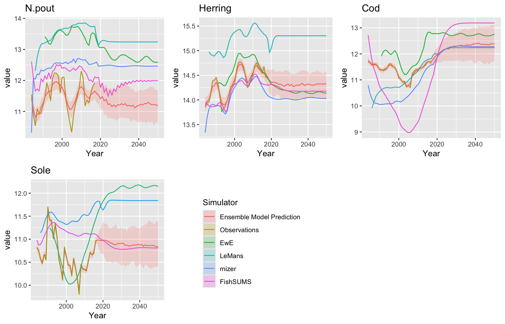

## Introduction

EcoEnsemble is an R package that combines several ecosystem models into one overall prediction. Instead of relying on only one model, EcoEnsemble compares the predictions from multiple simulators and combines them with observed data.

In this example, the package uses four different ecosystem simulators and real observations of fish biomass in the North Sea. The result is a single ensemble prediction with uncertainty.

This document reproduces the EcoEnsemble figure outputs in R using the workflow and example datasets described in a scientific paper. Specifically, this document reproduces the prior predictive and posterior predictive representations of spawning-stock biomass for four North Sea fish species:

* Norway pout
* Herring
* Cod
* Sole

The analysis combines observations with outputs from four ecosystem simulators:

* EwE (Ecopath with Ecosim): a North Sea ecosystem simulator with 60 functional groups
* LeMans: a discrete-time length-based model describing growth and predation
* mizer: a size-based model describing feeding, growth, mortality, and reproduction
* FishSUMS: a discrete-time length-based model that includes growth, fishing, predation, and seasonal reproduction


## Loading Packages

```{r, message=FALSE, warning=FALSE}
library(EcoEnsemble)
library(ggplot2)
```

## Defining Priors

The EcoEnsemble model requires prior assumptions before fitting the data.

The following code defines the prior assumptions for the EcoEnsemble model. Priors describe what the model assumes about uncertainty and variability before it is fitted to the observed data.


```{r, eval=FALSE}
priors <- EnsemblePrior(4,
  ind_st_params = IndSTPrior("hierarchical",
    list(-3, 1, 8, 4),
    list(0.1, 0.1, 0.1, 0.1),
    AR_params = c(2, 2)),
  ind_lt_params = IndLTPrior("lkj", list(1, 1),1),
  sha_st_params = ShaSTPrior("lkj", list(1, 10), 1, AR_params = c(2, 2)),
  sha_lt_params = 5)
```

## Understanding the Figures

The figures in this document are multi-line time-series plots.

Each panel represents one fish species:

* Norway pout
* Herring
* Cod
* Sole

Within each panel:

* The horizontal axis shows the year from 1984 to 2050
* The vertical axis shows the natural logarithm of spawning-stock biomass
* Each colored line represents either:
  * observed data
  * one of the ecosystem simulators
  * the EcoEnsemble prediction

The shaded ribbons around the EcoEnsemble line show uncertainty. A wider ribbon means there is more uncertainty in the prediction.

## Figure 1: Prior Predictive Distribution of Spawning-Stock Biomass

This code creates the prior version of the EcoEnsemble model. At this stage, the model has not yet been fitted to the real fish biomass observations.

```{r, eval=FALSE}
prior_fit <- prior_ensemble_model(
  priors = priors,
  M = 4,
  full_sample = TRUE
)
```

This code generates a sample from the prior model using the built-in observations and
simulator outputs. The result is stored in `prior_samples`, which can then be plotted.

```{r, eval=FALSE}
prior_samples <- sample_prior(
  observations = list(SSB_obs, Sigma_obs),
  simulators = list(
    list(SSB_ewe, Sigma_ewe, "EwE"),
    list(SSB_lm, Sigma_lm, "LeMans"),
    list(SSB_miz, Sigma_miz, "mizer"),
    list(SSB_fs, Sigma_fs, "FishSUMS")
  ),
  priors = priors,
  sam_priors = prior_fit,
  num_samples = 1,
  full_sample = TRUE
)
```

```{r, eval=FALSE}
png("Figure1_paper_style.png", width = 1400, height = 900, res = 150)
plot(prior_samples)
dev.off()
```

```{r, echo=FALSE, out.width='100%'}

```

**Figure 1. Prior Predictive Distribution of Spawning-Stock Biomass**

Figure 1 shows what the model predicts before it has been fitted to the data. This is called the prior predictive distribution.

The figure is a faceted time-series plot. Each panel shows one fish species, and the lines show the predictions from the four simulators together with the ensemble model.

Because the model has not yet used the observed data, the uncertainty bands are generally wide.


## Figure 2: Posterior Predictive Distribution of Spawning-Stock Biomass

This code fits the EcoEnsemble model to the observations and simulator outputs. This is the main step where the model learns from the data and produces the posterior result.

```{r, eval=FALSE}
fit <- fit_ensemble_model(
  observations = list(SSB_obs, Sigma_obs),
  simulators = list(
    list(SSB_ewe, Sigma_ewe, "EwE"),
    list(SSB_lm, Sigma_lm, "LeMans"),
    list(SSB_miz, Sigma_miz, "mizer"),
    list(SSB_fs, Sigma_fs, "FishSUMS")
  ),
  priors = priors,
  full_sample = TRUE,
  chains = 1,
  iter = 300,
  warmup = 150,
  cores = 1
)
```

After the model has been fitted, this code generates a sample from the fitted model. This sample is used to create the posterior predictive figure.

```{r, eval=FALSE}
samples <- generate_sample(fit, num_samples = 1)
```

```{r, eval=FALSE}
png("Figure2_paper_style.png", width = 1400, height = 900, res = 150)
plot(samples)
dev.off()
```

```{r, echo=FALSE, out.width='100%'}

```

**Figure 2. Posterior Predictive Distribution of Spawning-Stock Biomass**

Figure 2 shows the fitted EcoEnsemble result after the observed data have been included. This is called the posterior predictive distribution.

The figure uses the same type of time-series representation as Figure 1, but now the ensemble prediction is informed by the observed fish biomass data.

The lines show how the biomass of each species changes through time, while the shaded regions show the uncertainty around the final ensemble prediction.

## Conclusion

This exercise demonstrates how EcoEnsemble can combine several ecosystem simulators and observed data into a single prediction.

Figure 1 shows the model before it has used the observed data, while Figure 2 shows the model after it has been fitted to those data. Comparing the two figures shows how the observations reduce uncertainty and improve the final prediction.
